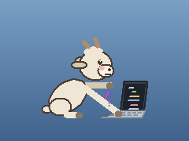
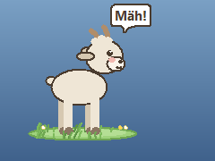
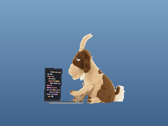
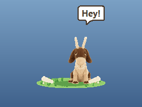
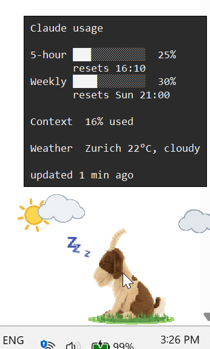
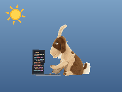
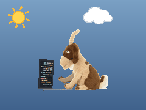
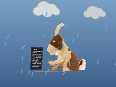
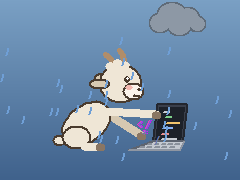
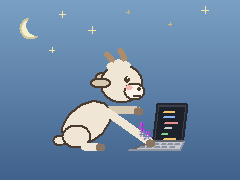

# Claude Buddy

A floating desktop mascot for Claude Code on Windows. It reacts to what Claude is doing:
working, waiting for you, or idle. Mascots: the goat (default), Pip, or your own images,
switched from the right-click menu.

| | Idle | Working | Needs you |
|---|:---:|:---:|:---:|
| **Goat** |  |  |  |
| **My images** |  |  |  |

### Usage on hover

Hover over the mascot to see your usage limits (5-hour and weekly %, reset times, context
used) and the current weather:



### Live weather

The scene follows the weather where you are (or pick a test weather from the menu).

| Sunny | Partly cloudy | Cloudy | Rain |
|:---:|:---:|:---:|:---:|
|  |  |  |  |
| **Snow** | **Fog** | **Thunderstorm** | **Clear night** |
|  |  |  |  |

Previews are recorded with `python tools/record_previews.py` (the widget itself has a
transparent background; the blue is added for the recording).

## Install

Needs Python 3 for Windows (the python.org installer includes Tkinter).

1. Clone or unzip anywhere, open a terminal in the folder.
2. `python install.py`
3. Fully quit the Claude desktop app (tray icon > Quit) and reopen it.

The mascot appears bottom-right, always on top, and starts at login.

| State | When |
|---|---|
| working... | Claude is busy (Pip walks, bulb glows; the goat types) |
| needs your input | permission prompt / question (hops and calls out) |
| idle | finished (sleeps) |

Several Claude Code sessions at once are fine: if any is busy, the mascot works.

Limits in the hover tooltip come from a small Claude Code mod (`usage-mod`, works in the desktop app) and the
status line (terminal), for Pro/Max plans, after the first reply in a session.

Left-drag to move. Right-click: test states, switch mascot, weather, reset position, hide, quit.

Options:

```
python install.py --no-startup   # no auto-start at login
python install.py --uninstall
```

## Tray icon

A goat icon sits in the system tray (by the clock; it may be under the `^` overflow arrow,
drag it onto the taskbar to keep it visible). Its dot shows the state: grey idle, green
working, red needs you.

Right-click the goat > **Hide to tray** to tuck it away; click the tray icon to bring it
back. While hidden it pops back up by itself when Claude needs your input. Needs `pystray`
and `pillow` (the installer pip-installs them).

## Starting it

`install.py` is a one-time setup (rerun it only after editing these files). The goat
auto-starts at login. If you quit it, press Windows, type **Claude Buddy** and hit Enter
(Start menu shortcut), or run:

```
pythonw "%USERPROFILE%\.claude\goat\goat_widget.pyw"
```

Only one goat runs at a time, so starting it twice is harmless.

## Using your own images

Right-click > **Open my images folder** (the `custom/` folder in this repo) and add:

- `idle.png` or `idle.gif`
- `busy.png` or `busy.gif` (animated GIFs play at 10 frames/sec)
- `waiting.png` or `waiting.gif`

Then right-click > **Mascot: My images** (or **Reload my images** after changing files).
Any missing state reuses another image.

The goat reads them straight from this repo's `custom/` folder (`install.py` saves that
path, and picks "My images" on a fresh install), so they travel with the repo. Keep the
repo where you installed it from; if you move it, rerun `install.py`.

Tips: about 80-120 px tall looks right. Hard-edged transparency (pixel art, or GIF) looks
cleanest; soft PNG edges can show a faint pink fringe. Images are shown as-is, centred,
with a bob/hop.

## Status line

The installer sets a Claude Code status line (it feeds the tooltip). If you already had
one, it is kept: its output is still shown, and `--uninstall` restores it exactly.
